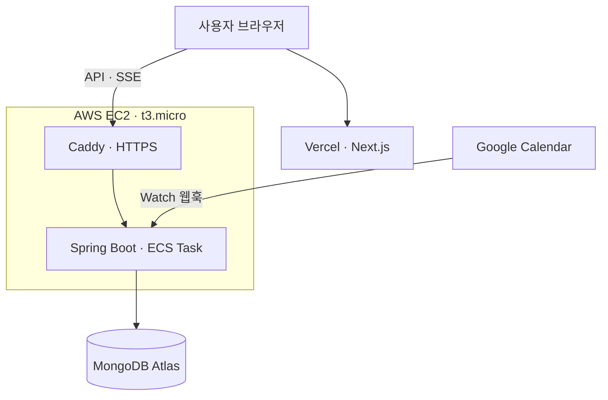

<div align="center">

# 📅 맞춰봄 Backend

**모임 참여자들의 캘린더를 모아 모두가 가능한 시간을 찾아주는 일정 조율 서비스**

[](https://matuabom.store)


</div>

## 소개

모임을 만들고 친구를 초대하면, 참여자들의 Google Calendar 일정을 모아 **모두가 비어 있는 시간**을 계산합니다.
외부 캘린더에서 일정이 바뀌면 새로고침 없이 화면에 바로 반영됩니다.

- 카카오 · 구글 소셜 로그인, 초대 코드로 친구 추가
- Google Calendar 연동과 실시간 동기화 (Watch 웹훅 + SSE)
- 참여자 일정 기반 가능 시간 계산, 모임 확정
- 시간표 등록, 모임 통계

## 아키텍처



| 구분 | 구성 |
|---|---|
| 애플리케이션 | Java 21, Spring Boot 3.5, Spring Security, OAuth2 Client, JWT |
| 데이터 | MongoDB Atlas (단일 저장소) |
| 실시간 | Google Calendar Watch 웹훅, Server-Sent Events |
| 인프라 | AWS ECS on EC2, ECR, SSM Parameter Store, Route 53, Caddy · Terraform([Deploy](https://github.com/Dahllyuhrah-Dahllyuhk/Deploy)) |
| CI/CD | GitHub Actions (OIDC 인증, `develop` push 시 자동 배포) |

## 기술적 결정

### 1. 외부 캘린더 변경을 실시간으로 반영하기
- **문제:** 사용자가 Google Calendar에서 일정을 바꿔도 서비스 화면에는 반영되지 않았습니다. 주기적으로 조회(폴링)하면 반영이 늦고 외부 API 호출이 낭비됩니다.
- **결정:** Google Calendar **Watch 웹훅**으로 변경 알림을 받고, **SSE**로 해당 사용자 화면에 바로 전달합니다.
- **보완:** Watch 채널은 만료 기한이 있어서, 매일 새벽 만료 전 채널을 자동 갱신하는 스케줄러(`WatchChannelRenewalService`)를 두었습니다.

### 2. 동시 요청에서 정상 사용자가 로그아웃되던 문제
- **문제:** 여러 SSE 연결과 API 요청이 동시에 refresh token을 회전시키면서 토큰이 서로 어긋나, 정상 사용자가 로그아웃됐습니다.
- **원인:** SSE가 연결·재연결할 때마다 refresh token으로 인증해 회전을 일으키고 있었습니다.
- **해결** (`JwtAuthFilter`)
  - SSE는 access token으로 인증하도록 분리해 회전 자체를 줄였습니다.
  - 사용자별 토큰 갱신을 락으로 직렬화했습니다.
  - 직전에 회전된 토큰은 30초 동안 현재 토큰으로 수렴시킵니다(grace window).

### 3. 저장소 3개(PostgreSQL · MongoDB · Redis)를 MongoDB 하나로 통합
- **배경:** 사용자가 적은 서비스에 저장소 3개를 운영하는 비용과 관리 부담이 컸고, 데이터 대부분이 문서형(캘린더 이벤트)이었습니다.
- **대체한 것**
  - Redis가 맡던 토큰 · 초대 코드 · 락 → MongoDB TTL 인덱스와 unique 키 기반 락
  - TTL 인덱스는 약 60초 주기로 지우기 때문에 만료 시점이 부정확합니다. 그래서 **읽을 때 애플리케이션에서 만료를 한 번 더 확인**합니다.
- **포기한 것:** 관계형 JOIN과 제약 조건, Redis의 정확한 만료 시점

### 4. 배포 구조 전환
- **이전:** EC2 한 대에 docker-compose, 장기 AWS 키와 SSH로 배포
- **현재:** ECS on EC2 + Caddy(HTTPS), GitHub Actions **OIDC** 인증으로 정적 키를 제거했습니다. 로드밸런서, NAT, RDS 없이 프리티어 범위 안에서 운영합니다.

## 알려진 한계

- **SSE 연결은 서버 메모리에서 관리**합니다. 서버가 한 대일 때만 동작하고, 여러 대로 늘리면 Redis Pub/Sub 같은 외부 브로커가 필요합니다.
- 브라우저 `EventSource`는 헤더를 보낼 수 없어서, SSE 경로에서만 **access token을 쿼리 파라미터로** 받습니다. 토큰 수명이 짧아 노출 위험은 제한적이지만, 쿠키 기반 인증으로 바꾸는 것이 더 안전합니다.
- MongoDB Atlas 무료 티어(M0)를 사용해 저장 용량과 성능 보장에 제한이 있습니다.

## 실행 방법

```bash
# 1. MongoDB 실행 (로컬)
docker run -d --name matuabom-mongo -p 27017:27017 mongo:7

# 2. 환경변수 설정: .env.example을 복사해 값 채우기
cp .env.example .env

# 3. 실행
./gradlew bootRun --args='--spring.profiles.active=local'

# 테스트
./gradlew test
```

## 프로젝트 구조

```
src/main/java/org/dallyeo/matuabom
├── auth        # 소셜 로그인, JWT 발급·회전
├── calendar    # Google Calendar 연동, Watch 웹훅, 채널 갱신
├── meeting     # 모임, 초대, 가능 시간 계산
├── timetable   # 시간표
├── user        # 회원, 친구, 초대 코드
├── sse         # 실시간 이벤트 전송
├── stats       # 모임 통계
├── admin       # 관리자 API
└── global      # 보안 설정, 필터, 공통 설정
```

## 팀

| 기간 | 구성 |
|---|---|
| 2025.09 ~ 2025.12 | FE 1 · BE 2 · AI 1 |
| 2026.04 ~ 2026.07 | 리팩토링 · 재배포 (저장소 통합, ECS 전환) |

작업 규칙(이슈 · 브랜치 · PR)은 [CONTRIBUTING.md](./CONTRIBUTING.md)를 참고하세요.
